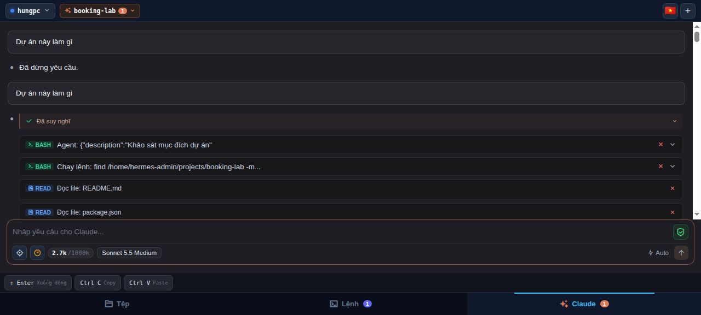
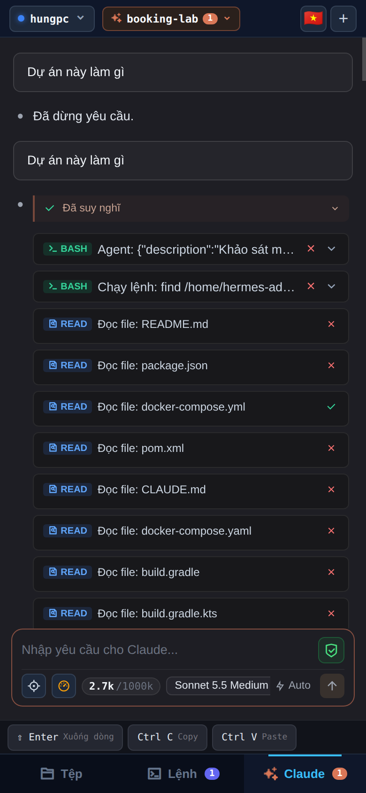
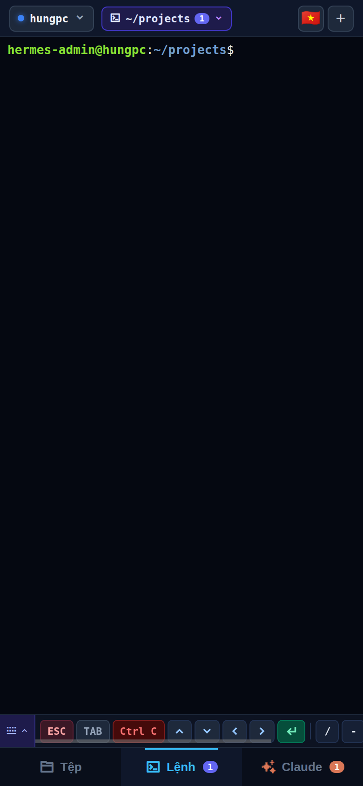
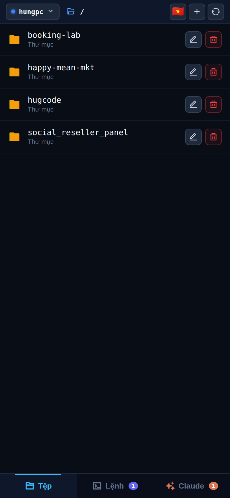
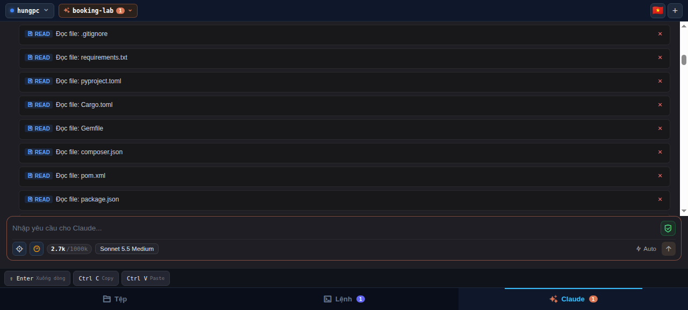
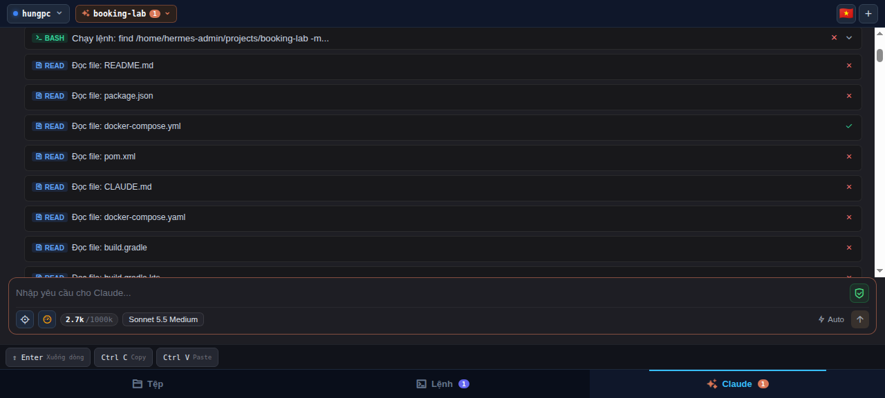
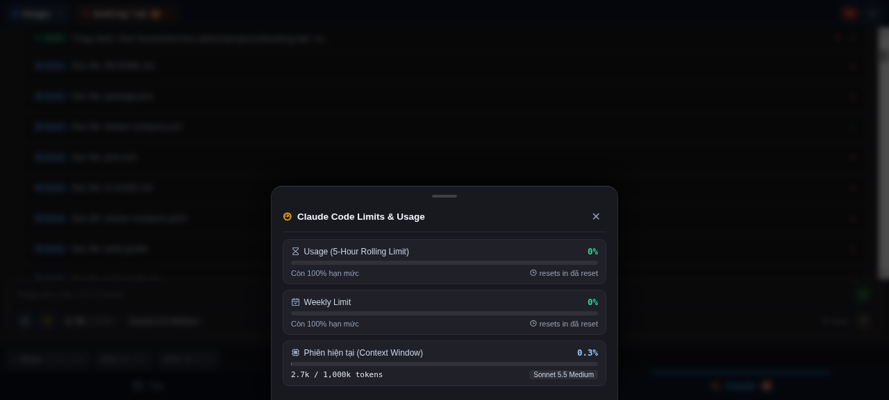
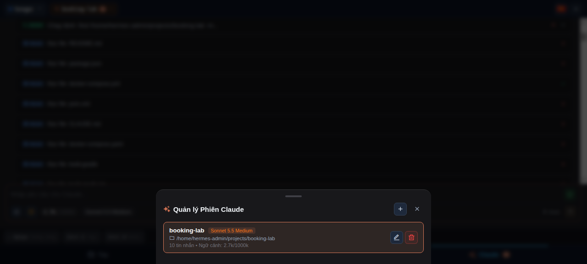

# 🐴 HugRemote — Mobile-First Web IDE & Terminal

> **Mobile-first web IDE, multi-window terminal, and Claude Code coding assistant optimized for phones.**

---

## 📸 Screenshots & Preview

### 💻 Desktop Experience
Full-featured desktop workspace with multi-tab terminal, file explorer, and Claude Code assistant:

<p align="center">
  
</p>

### 📱 Mobile Experience
Mobile-first UI crafted for phones with touch-optimized controls, mobile shortcut bar, bottom-sheet modals, and Claude Code integration:

<p align="center">
  
  &nbsp;&nbsp;
  
  &nbsp;&nbsp;
  
</p>

### 🤖 Claude Code Features & Tool Flow
Rich developer experience tailored specifically for Claude Code:

<p align="center">
  
  &nbsp;
  
</p>

<p align="center">
  
  &nbsp;
  
</p>

---

## ⚡ Quick Install

**Stable Release (v1.0.1):**
```bash
curl -fsSL https://raw.githubusercontent.com/vibecoding-hungkc/hugremote/main/install.sh | bash
```

**Beta / Latest Main Branch (dành cho bản vá mới nhất):**
```bash
curl -fsSL https://raw.githubusercontent.com/vibecoding-hungkc/hugremote/main/beta.sh | bash
```

Alternative:

```bash
npx hugremote
npm install -g hugremote
hugremote
```

---

## 🚀 CLI Usage

```bash
# Default: port 8099, no auth
hugremote

# Reverse proxy / Cloudflare Tunnel subpath
hugremote -p 8099 -b /remote

# Password auth: one password field, no username
hugremote --auth password --password 'your-password'

# Google auth
AUTH_MODE=google \
APP_URL=https://your-domain.com \
BASE_PATH=/remote \
GOOGLE_CLIENT_ID=... \
GOOGLE_CLIENT_SECRET=... \
GOOGLE_ALLOWED_EMAILS=user@gmail.com,admin@domain.com \
hugremote
```

### CLI Options

| Option | Description | Default |
|---|---|---|
| `-p, --port <number>` | HTTP & WebSocket port | `8099` or `$PORT` |
| `-h, --host <ip>` | Bind address | `::` or `$HOST` |
| `-b, --base-path <path>` | Subpath prefix, e.g. `/remote` | `""` or `$BASE_PATH` |
| `-w, --workspace <dir>` | Default workspace | `~/projects` or `$WORKSPACE_ROOT` |
| `-a, --allowed-root <dir>` | Maximum file-browser access root | `~` or `$ALLOWED_ROOT` |
| `--auth <mode>` | `none`, `password`, or `google` | `none` or `$AUTH_MODE` |
| `--password <pass>` | Initial password (default: `123456`, forces change on 1st login) | `123456` |
| `--app-url <url>` | Public app URL for Google OAuth | `http://localhost:8099` or `$APP_URL` |
| `-v, --version` | Print version | `1.0.0` |
| `--help` | Show help | |

---

## 🔐 Authentication

HugRemote supports three auth modes.

### 1. No Auth

```env
AUTH_MODE=none
```

This is the default. Use it for localhost, trusted LAN, or when Cloudflare Access / another reverse proxy already protects the app.

### 2. Password Auth (Default `123456` + Mandatory First-Time Change)

```env
AUTH_MODE=password
SESSION_SECRET=random-long-secret
AUTH_MAX_ATTEMPTS=5
AUTH_LOCK_MINUTES=15
```

Behavior & Security:

- **Không cần điền mật khẩu ở file `.env`**: Bạn không cần cấu hình `AUTH_PASSWORD` trong file môi trường hay file service.
- **Mật khẩu mặc định ban đầu**: Khi bật chế độ `AUTH_MODE=password`, mật khẩu mặc định khởi tạo là `123456`.
- **Bắt buộc đổi mật khẩu khi truy cập lần đầu**: Khi người dùng đăng nhập lần đầu bằng mật khẩu mặc định `123456`, hệ thống tự động khóa quyền truy cập terminal & tệp và hiển thị form **bắt buộc đổi mật khẩu mới**.
- **Mã hóa và lưu trữ an toàn**: Mật khẩu mới được băm bằng thuật toán mật mã mạnh PBKDF2-SHA512 (100.000 vòng lặp) cùng với Salt ngẫu nhiên 32-byte, lưu trữ có phân quyền an toàn (`0600`) tại `~/.config/hugremote/auth.json`. Mật khẩu dạng thô (plaintext) tuyệt đối không được lưu trữ.
- **Chống tấn công Brute-force**: 5 lần nhập sai liên tiếp từ cùng một IP (bao gồm IP thật từ Cloudflare `CF-Connecting-IP`) sẽ tự động khóa 15 phút (`HTTP 429`).
- **Bảo mật phiên đăng nhập**: Session cookie được ký HMAC-SHA256, đính kèm đầy đủ các cờ bảo vệ `HttpOnly`, `SameSite=Lax`, `Secure` và giới hạn `Path`.

### 3. Google Login

```env
AUTH_MODE=google
APP_URL=https://your-domain.com
BASE_PATH=/remote
GOOGLE_CLIENT_ID=...
GOOGLE_CLIENT_SECRET=...
GOOGLE_ALLOWED_EMAILS=user@gmail.com,admin@domain.com
SESSION_SECRET=random-long-secret
```

Only emails in `GOOGLE_ALLOWED_EMAILS` can access the app.

Google OAuth Redirect URI:

```text
${APP_URL}${BASE_PATH}/auth/google/callback
```

Examples:

```text
http://localhost:8099/auth/google/callback
https://hugtech.buaanvuive.com/remote/auth/google/callback
```

---

## 🤖 Telegram Bot Integration

HugRemote tích hợp sẵn Telegram Bot (sidecar không ảnh hưởng hiệu năng), cho phép điều khiển **Claude Code CLI** và chạy **Terminal** từ xa trên điện thoại qua ứng dụng Telegram.

### 1. Cấu hình Telegram

Thêm các biến sau vào `~/.config/hugremote/.env` hoặc truyền qua biến môi trường:

```env
# Token lấy từ @BotFather (Bắt buộc để kích hoạt bot)
TELEGRAM_BOT_TOKEN=123456789:ABCdefGHIjklMNOpqrsTUVwxyz

# Whitelist User ID hoặc username Telegram được phép dùng (Ngăn người lạ truy cập)
TELEGRAM_ALLOWED_USERS=123456789,my_username

# Bật chế độ Topic Mode (mỗi Topic là 1 phiên Claude độc lập)
TELEGRAM_TOPIC_MODE=true
```

> **Cách lấy User ID**: Gửi tin nhắn bất kỳ cho [@userinfobot](https://t.me/userinfobot) trên Telegram để nhận ID số của bạn.

### 2. Thiết lập Chế độ Topic (Threaded Mode) trong @BotFather

Để mỗi Topic trong bot đóng vai trò là một phiên làm việc độc lập:
1. Mở [@BotFather](https://t.me/BotFather) → chọn bot của bạn.
2. Vào **Bot Settings** → **Threads Settings**.
3. Bật **Threaded Mode: ON**.

### 3. Danh sách câu lệnh Telegram Bot

| Lệnh | Mô tả |
|---|---|
| `/new [tên] [cwd]` | Tạo phiên Claude Code mới (tự động gán vào Topic hiện tại). |
| `/resume [id]` | Khôi phục hoặc chuyển đổi sang phiên làm việc cũ. |
| `/compact` | Kích hoạt tóm tắt và nén ngữ cảnh hội thoại hiện tại để tiết kiệm token. |
| `/clear` | Xóa sạch lịch sử tin nhắn trong phiên hiện tại (giữ nguyên thư mục làm việc). |
| `/stop` (hoặc `/abort`) | Huỷ ngay lệnh Claude hoặc tiến trình đang thực thi. |
| `/status` (hoặc `/limits`) | Xem thông tin chi tiết phiên và hạn mức Claude (5-giờ, tuần). |
| `/sessions` (hoặc `/ls`) | Liệt kê danh sách các phiên làm việc đang có. |
| `/terminal <lệnh>` | Chạy lệnh Bash trực tiếp trên máy chủ tại thư mục làm việc hiện tại. |
| `/cd <đường_dẫn>` | Đổi thư mục làm việc của phiên hiện tại. |
| `/pwd` | Xem thư mục làm việc hiện tại. |
| `/topic [on\|off]` | Bật/tắt chế độ Topic Mode cho cuộc trò chuyện. |
| `/help` | Xem danh sách hướng dẫn và phím tắt. |

*(Tin nhắn văn bản thông thường gửi vào Topic sẽ được chuyển tiếp trực tiếp thành prompt cho Claude Code với streaming trực tiếp)*

---

## 📱 Key Features

- **Mobile-First PWA**: Scoped CSS, dark theme, iOS safe-area support, and touch-first ergonomics.
- **Claude Code Mobile UI**: Real Claude CLI process integration with streaming thinking, tool invocation cards (Bash, Read, Edit), compact task mode, token & usage telemetry popup, and stop button (`SIGINT`).
- **Real PTY Terminal**: Full-featured xterm.js over WebSocket with mobile shortcut bar (`Esc`, `Tab`, `Ctrl+C`, `Ctrl+D`) and expandable quick-drawer.
- **File Explorer**: Browse directories, search, create/rename/delete items, folder tree picker modal, and syntax-highlighted code viewer.
- **Multi-Language (i18n)**: Instant switching between English (🇺🇸) and Vietnamese (🇻🇳).
- **Flexible Auth**: Zero-configuration `none`, password-only with brute-force lockout, or Google OAuth 2.0 with email whitelist.

---

## 🛠️ User Systemd Service on Linux

```bash
systemctl --user start hugremote
systemctl --user enable hugremote
systemctl --user status hugremote
systemctl --user restart hugremote
systemctl --user stop hugremote
```

Edit service env at:

```bash
~/.config/systemd/user/hugremote.service
```

Then reload/restart:

```bash
systemctl --user daemon-reload
systemctl --user restart hugremote
```

---

## 📄 License

Released under the [MIT](LICENSE) license.
